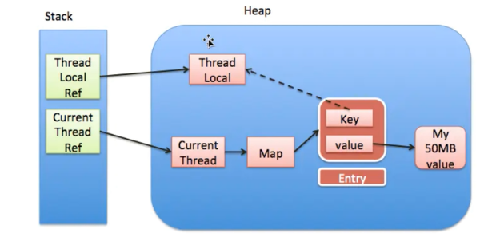
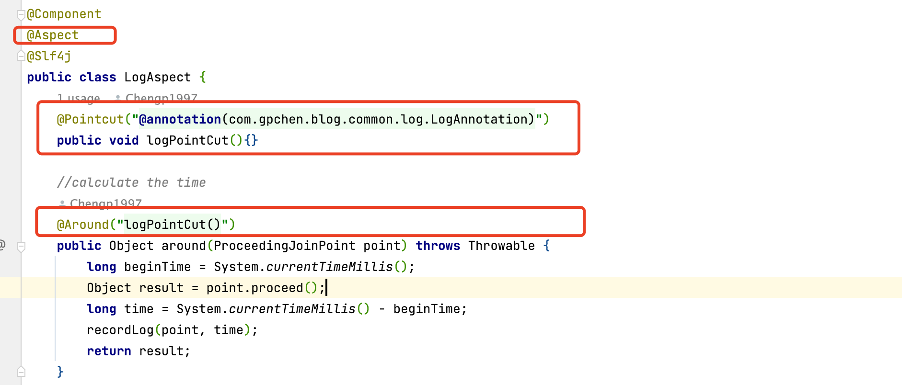

# myBlogDemo

This is the demo of blog application, It's a RESTful Web App

- MyBlogWebsiteFullModules: backend 
  - Blog-api : apis for blog view page
  - Blog-admin: administration system of the blog (in developing)
- Blog-app: front end

I put my demo [here](http://www.gpchen.me/#/) 

# What I learned

## Structure


## Technologies

| Technologies    | Description                                                  |
| --------------- | ------------------------------------------------------------ |
| Springboot      | Spring+SpringMVC framework                                   |
| MyBatis         | ORM framework                                                |
| MySQL           | Database                                                     |
| Redis           | For cache                                                    |
| Lombok          | code generator for construcotr, getter setter ……             |
| AWS SDK         | used to upload pic for S3                                    |
| JWT             | As login logout utils                                        |
| ThreadPool      | used to update cache                                         |
| Spring Security | used in backend management system as permission handler      |
| nginx           | as web server when deploying on ec2                          |
| docker          | used in deployment to create mysql/redis/nginx/app container |
| EC2             | Server                                                       |

# Notes

## Exception Handler

Used Exception Handler to catch all possible exceptions in the app, and return as a result back to users. 

@ControllerAdvice -- a realization of aop, 

```java
package com.gpchen.blog.handler;

import com.gpchen.blog.model.vo.ErrorCode;
import com.gpchen.blog.model.vo.Result;
import org.springframework.web.bind.annotation.ControllerAdvice;
import org.springframework.web.bind.annotation.ExceptionHandler;
import org.springframework.web.bind.annotation.ResponseBody;

//AOP, exception occurred for on controller, This advice would trigger to handle and print out the trace
@ControllerAdvice
public class AllExceptionHandler {
    @ExceptionHandler(Exception.class)
    @ResponseBody  //The exception will reply as json
    public Result doException(Exception e){
        e.printStackTrace();
        return Result.fail(ErrorCode.SYSTEM_ERROR.getCode(), ErrorCode.SYSTEM_ERROR.getMsg());
    }
}
```

## JWT

### Intro

[what is JWT](https://jwt.io/introduction)

[JWT wiki](https://en.wikipedia.org/wiki/JSON_Web_Token)

JWT can generate a token. When user asked for resources that needs to be login to view, the token can be used for authorization.

- JWT structure
  - **Header**: {"type":"JWT","alg":"HS256"} , type of token and hash algorithm
  - **Payload**: info about token, like id, expire time. Readable for everyone, do not put secret info here unless it is encrypted 
  - **Signature**: hashAlgorithm(encoded(Header), encoded(Payload), secretKey)

### How to use it

Dependency 

```xml
<!--jwt-->
<dependency>
    <groupId>io.jsonwebtoken</groupId>
    <artifactId>jjwt</artifactId>
    <version>0.9.1</version>
</dependency>

<!--md5-->
<dependency>
  	<groupId>commons-codec</groupId>
  	<artifactId>commons-codec</artifactId>
</dependency>
```

JWTUtils.java

Two main functions

- create token
- Verify token

```java
package com.gpchen.blog.util;

import io.jsonwebtoken.Jwt;
import io.jsonwebtoken.JwtBuilder;
import io.jsonwebtoken.Jwts;
import io.jsonwebtoken.SignatureAlgorithm;

import java.util.Date;
import java.util.HashMap;
import java.util.Map;

public class JWTUtils {
    //secret key
    private static final String jwtToken = "123456Mszlu!@###$$";

    //generate token
    public static String createToken(Long userId){
        //set payload
        Map<String,Object> payload = new HashMap<>();
        payload.put("userId",userId);

        //codec
        JwtBuilder jwtBuilder = Jwts.builder()
                .signWith(SignatureAlgorithm.HS256, jwtToken) // hash algorithm
                .setClaims(payload) // data to be hashed
                .setIssuedAt(new Date()) // issue date
                .setExpiration(new Date(System.currentTimeMillis() + 24 * 60 * 60 * 1000));// expire time
        String token = jwtBuilder.compact();
        return token;
    }

    //check token
    public static Map<String, Object> checkToken(String token){
        try {
            Jwt parse = Jwts.parser().setSigningKey(jwtToken).parse(token);
            return (Map<String, Object>) parse.getBody();
        }catch (Exception e){
            e.printStackTrace();
        }
        return null;

    }
}

```

I used JWT in login, logout, register modules to create a token, and in modules that needs to check login status.

**login**: when we login, we generate a token and put it into redis. Everytime we need to access a resource that needed to be login, we use JWT for authorizaiton.


**logout**: when we logout, we need to delete the token from redis.


## Interceptor

### Intro

[What is Spring interceptor](https://www.tutorialspoint.com/spring_boot/spring_boot_interceptor.htm)    [Java 拦截器](https://www.jianshu.com/p/d25349f0ab02)

[Difference between filter/interceptor/AOP](https://programmer.ink/think/springboot-foundation-of-microservice-series-filter-interceptor-and-aop-aspect.html)  [过滤器/拦截器/AOP](https://blog.csdn.net/dreamwbt/article/details/82658842)


Inteceptor will execute before an action start. 

It's a manifestation of AOP. Interceptor Interceptors can only intercept **URLs**, while AOP can implement more complex business logic for specific codes.

### How to use it

LoginInterceptor.java: In this projecrt, interceptor is used to intercept access of recources that needed to login. 

- PreHandle(): Before entering the url, first check if needed to login. If not login, then intercept the user, else put the user into threadLocal(see ThreadLocal Tags), so that system can get the user conviniently
- afterCompletion(): after preHandle returns true, and the action is completed, remove the user from threadLocal. 

```java
package com.gpchen.blog.handler;

import com.alibaba.fastjson.JSON;
import com.gpchen.blog.model.entity.SysUser;
import com.gpchen.blog.model.vo.ErrorCode;
import com.gpchen.blog.model.vo.Result;
import com.gpchen.blog.service.SSOService;
import com.gpchen.blog.util.UserThreadLocal;
import lombok.extern.slf4j.Slf4j;
import org.apache.commons.lang3.StringUtils;
import org.springframework.beans.factory.annotation.Autowired;
import org.springframework.stereotype.Component;
import org.springframework.web.method.HandlerMethod;
import org.springframework.web.servlet.HandlerInterceptor;

import javax.servlet.http.HttpServletRequest;
import javax.servlet.http.HttpServletResponse;

@Component
@Slf4j
public class LoginInterceptor implements HandlerInterceptor {//The interceptor for all resources that needed to log in

    @Autowired
    private SSOService ssoService;

    /**
     * before go to controller, preHandle will trigger first
     * condition:
     * 1. the api path is a method of controller--if only search for resources, no need to intercept
     * 2. if current token is empty-- not log in--need to log in, goes to the login page
     * 3. if current token is not empty, need to verify the token.
     * 4. if token is verified, can release the resource
     */
    @Override
    public boolean preHandle(HttpServletRequest request, HttpServletResponse response, Object handler) throws Exception {
        //check the path -> not handler method(not controller method) let go.
        if(! (handler instanceof HandlerMethod))return true;
        //check token
        String token = request.getHeader("Authorization");
        log.info("=================request start===========================");
        String requestURI = request.getRequestURI();
        log.info("request uri:{}",requestURI);
        log.info("request method:{}",request.getMethod());
        log.info("token:{}", token);
        log.info("=================request end===========================");

        //if token is empty -> not log in, need to log in
        if(StringUtils.isBlank(token)){
            Result result = Result.fail(ErrorCode.NO_LOGIN.getCode(), ErrorCode.NO_LOGIN.getMsg());
            response.setContentType("application/json;charset=utf-8");
            response.getWriter().println(JSON.toJSONString(result));
            return false;
        }

        //if token is not empty, need to verify the token, whether the user exist
        SysUser sysUser = ssoService.checkToken(token);
        if(sysUser==null){
            Result result = Result.fail(ErrorCode.NO_LOGIN.getCode(), ErrorCode.NO_LOGIN.getMsg());
            response.setContentType("application/json;charset=utf-8");
            response.getWriter().println(JSON.toJSONString(result));
            return false;
        }
        //put current user into ThreadLocal, so that we can get current user in a more easy way
        UserThreadLocal.put(sysUser);
        return true;
    }

    @Override
    public void afterCompletion(HttpServletRequest request, HttpServletResponse response, Object handler, Exception ex) throws Exception {
        UserThreadLocal.remove();
    }
}
```

**Configuration in Java Config class**

If we want to make it work, we need to configure it in the config class.

use the `InterceptorRegistry` class to register the url to the interceptors. So that, it will takeEffect when users wants to access some resources.

```java
public void addInterceptors(InterceptorRegistry registry){
    //Interceptors for login interceptor, when there are pages needed to be login, this will triggered
    registry.addInterceptor(loginInterceptor)
            .addPathPatterns("/comments/create/change")//only comemnt when login, else will fail
            .addPathPatterns("/articles/publish");
}
```

## ThreadLocal

**Problem**

If we want to get the user info after we log in, we need to search in db and put it in redis. This costs so much, in this case, we need to search for a better solution for this situation.

### Intro

>  [ThreadLocal class](https://docs.oracle.com/javase/7/docs/api/java/lang/ThreadLocal.html) 
>
> This class provides thread-local variables. These variables differ from their normal counterparts in that each thread that accesses one (via its `get` or `set` method) has its own, independently initialized copy of the variable. `ThreadLocal` instances are typically private static fields in classes that wish to associate state with a thread (e.g., a user ID or Transaction ID).(每个线程都有一份本地副本，避免多线程操作导致数据不一致的情况)

[原理，源码解读，应用场景](https://pdai.tech/md/java/thread/java-thread-x-threadlocal.html) ，[用法](https://www.cnblogs.com/coshaho/p/5127135.html) [How is ThreadLocal implemented](https://stackoverflow.com/questions/1202444/how-is-javas-threadlocal-implemented-under-the-hood) 

> - 首先获取当前线程对象t, 然后从线程t中获取到ThreadLocalMap的成员属性threadLocals
> - 如果当前线程的threadLocals已经初始化(即不为null) 并且存在以当前ThreadLocal对象为Key的值, 则直接返回当前线程要获取的对象(本例中为SysUser);
> - 如果当前线程的threadLocals已经初始化(即不为null)但是不存在以当前ThreadLocal对象为Key的的对象, 那么重新创建一个SysUser对象, 并且添加到当前线程的threadLocals Map中,并返回
> - 如果当前线程的threadLocals属性还没有被初始化, 则重新创建一个ThreadLocalMap对象, 并且创建一个SysUser对象并添加到ThreadLocalMap对象中并返回。

### How to use it

```java
public class UserThreadLocal {
    private UserThreadLocal(){}

    private static final ThreadLocal<SysUser> LOCAL = new ThreadLocal<>();
    
    public static void put(SysUser sysUser){
        LOCAL.set(sysUser);
    }

    public static SysUser get(){
        return LOCAL.get();
    }

    public static void remove(){
        LOCAL.remove();
    }
}
```

In our project

- In interceptor, when users are accessing resources that needed to be login, when we find out that the user is login, we can put the current user in the threadlocal map, so after that, we can get the current sysUser immidiately without searching for db.


- So that, in such methods that are intercept by our login interceptor, we can get  we can get the user object in this convinient way.

pulishArticle(): url - "/articles/publish"


give Comments(): url-"/comments/create/change"


### Problem

> [Memory Leak](https://docs.microsoft.com/en-us/windows-hardware/drivers/debugger/finding-a-memory-leak) : A memory leak occurs when a process allocates memory from the paged or nonpaged pools, but does not free the memory. As a result, these limited pools of memory are depleted over time, causing Windows to slow down. If memory is completely depleted, failures may result.
>
> [Weak Reference](https://en.wikipedia.org/wiki/Weak_reference): a **weak reference** is a [reference](https://en.wikipedia.org/wiki/Reference_(computer_science)) that does not protect the referenced [object](https://en.wikipedia.org/wiki/Object_(computer_science)) from collection by a [garbage collector](https://en.wikipedia.org/wiki/Garbage_collection_(computer_science)), unlike a strong reference.
>
> [ThreadLocal原理及内存泄露预防](https://blog.csdn.net/puppylpg/article/details/80433271)



There is a problem here, in ThreadLocalMap, the reference of the ThreadLocal in the map is weak Reference. This means, when GC starts to collect the garbage, the threadLocal object will be destroyed, and the map would look like this <null, value>. In this case, there is no reference of the value, and the value can not be destroyed.

To solve this problem, removes the info every time we finish our process. In my project, in interceptor, remove the user everytime we finish the action.


## ThreadPool

### Intro

**Problem**: When we want to update the viewcounts of the article, the easiest way to do this is to increment the counts. However, this seems easy but actually it takes more than 1 steps:  get the original counts, update the counts. Plus, when multiple thread are updating, problems may occur. 

The easiest solution is to use the lock, block other users when updating. However, this may. Result in bad performance of the app. And when some problems occurred, the app may die.

 In this case, threadPool can be used here. Main process is used to view the articles, when threads are used to update the counts.

[乐观锁，悲观锁](https://www.jianshu.com/p/d2ac26ca6525) [乐观锁原理](https://blog.csdn.net/qq_37113604/article/details/81582784) 

### How to use it

Configure the Thread Pool, and do the update in the thread. 

In this case, the threadService use the **[CAS](https://www.infoworld.com/article/2078848/java-concurrency-java-101-the-next-generation-java-concurrency-without-the-pain-part-2.html?page=3)** to implement the service. When want to update the view, compare if it is just the previous number + 1. Compare the value, update only when it matches.

```java
package com.gpchen.blog.config;

import org.springframework.context.annotation.Bean;
import org.springframework.context.annotation.Configuration;
import org.springframework.scheduling.annotation.EnableAsync;
import org.springframework.scheduling.concurrent.ThreadPoolTaskExecutor;

import java.util.concurrent.Executor;

@Configuration
@EnableAsync // 开启多线程
public class ThreadPoolConfig {
    @Bean("taskExecutor")
    public Executor asyncServiceExecutor() {
        ThreadPoolTaskExecutor executor = new ThreadPoolTaskExecutor();
        executor.setCorePoolSize(5);
        executor.setMaxPoolSize(20);
        executor.setQueueCapacity(Integer.MAX_VALUE);
        executor.setKeepAliveSeconds(60);
        executor.setThreadNamePrefix("myBlog");
        executor.setWaitForTasksToCompleteOnShutdown(true);
        executor.initialize();
        return executor;
    }
}
```

```java
package com.gpchen.blog.service.impl;

import com.baomidou.mybatisplus.core.conditions.query.LambdaQueryWrapper;
import com.gpchen.blog.dao.ArticleMapper;
import com.gpchen.blog.model.entity.Article;
import org.springframework.scheduling.annotation.Async;
import org.springframework.stereotype.Component;

@Component
public class ThreadService {

    //期望在线程池中运行，这样就不会影响主线程
    @Async("taskExecutor")
    public void updateArticleViewCount(ArticleMapper articleMapper, Article article){
        int viewCount = article.getViewCounts();
        Article updateArticle = new Article();//为了最小限度的修改，增加一个新的对象，最后只把这个对象的情况更新进去
        updateArticle.setViewCounts(viewCount+1);
        LambdaQueryWrapper<Article> queryWrapper = new LambdaQueryWrapper<>();
        queryWrapper.eq(Article::getId,article.getId());
        //设置一个比较，为了在改动之前进行一次判断，是否有其他线程抢先修改，类似于CAS操作
        queryWrapper.eq(Article::getViewCounts,viewCount);
        //update article set viewcount=100 where viewCount=99 && id=1
        articleMapper.update(updateArticle,queryWrapper);
      
    }

}
```

## AWS S3 as image server

[官方文档](https://docs.aws.amazon.com/AmazonS3/latest/userguide/Welcome.html)

[AWS SDK for Java S3 Example](https://docs.aws.amazon.com/sdk-for-java/v1/developer-guide/examples-s3.html)

[Full example in Github](https://github.com/awsdocs/aws-doc-sdk-examples/tree/main/java/example_code/s3/src/main/java/aws/example/s3)

I used S3 as my image server in this project. 

```java
package com.gpchen.blog.util;

import com.amazonaws.auth.AWSCredentials;
import com.amazonaws.auth.AWSStaticCredentialsProvider;
import com.amazonaws.auth.BasicAWSCredentials;
import com.amazonaws.regions.Regions;
import com.amazonaws.services.s3.AmazonS3;
import com.amazonaws.services.s3.AmazonS3Client;
import com.amazonaws.services.s3.AmazonS3ClientBuilder;
import org.springframework.beans.factory.annotation.Value;
import org.springframework.stereotype.Component;
import org.springframework.web.multipart.MultipartFile;

import java.io.File;
import java.io.IOException;

@Component
public class AmazonS3Utils {
    public static  final String url = "https://s3.amazonaws.com/xxxx";
    @Value("${AmazonS3.accessKey}")
    private String accessKey;
    @Value("${AmazonS3.accessSecretKey}")
    private String secretKey;
    private final static String bucketName = "xxxxxx";
    public boolean upload(String fileName, MultipartFile file) {
        try {
            amazonS3().putObject(bucketName,fileName,multipartToFile(file,fileName));
            return true;
        } catch (Exception e) {
            e.printStackTrace();
        }
        return false;
    }

    private AmazonS3 amazonS3(){
        AWSCredentials awsCredentials = new BasicAWSCredentials(accessKey,secretKey);
        return   AmazonS3ClientBuilder
                .standard()
                .withRegion(Regions.US_EAST_1)
                .withCredentials(new AWSStaticCredentialsProvider(awsCredentials))
                .build();
    }

    public  static File multipartToFile(MultipartFile multipart, String fileName) throws IllegalStateException, IOException {
        File convFile = new File(System.getProperty("java.io.tmpdir")+"/"+fileName);
        multipart.transferTo(convFile);
        return convFile;
    }


}

```

## AOP

### For log

AOP can be used in log. It's quite convinient to use it here because it will triggered automatically.

- build the annotation
- build the aspect
- use the annotation

Annotation

```java
package com.gpchen.blog.common.log;

import java.lang.annotation.*;

@Target({ElementType.METHOD})
@Retention(RetentionPolicy.RUNTIME)
@Documented
public @interface LogAnnotation {
    //module name
    String module() default "";
    //what operation
    String operation() default  "";
}
```

Aspect

- @Pointcut: anywhere with this annotation
- @Around: apply before and after the action



use it


### For cache

I used redis as the cache db. Using cache, the system can have a better performance since it is faster. 

```xml
<dependency>
    <groupId>org.springframework.boot</groupId>
    <artifactId>spring-boot-starter-data-redis</artifactId>
</dependency>
```

We can also apply aop in cache. So we can use the cache in a much more convinient way. 

```java
package com.gpchen.blog.common.cache;

import java.lang.annotation.*;

@Target(ElementType.METHOD)
@Retention(RetentionPolicy.RUNTIME)
@Documented
public @interface Cache {

    //expire time for cache
    long expire() default 1*60*1000;
    //default name,as the key we are going to store in redis
    String name() default "";
}
```

```java
package com.gpchen.blog.common.cache;

import com.alibaba.fastjson.JSON;
import com.fasterxml.jackson.databind.ObjectMapper;
import com.gpchen.blog.model.vo.ErrorCode;
import com.gpchen.blog.model.vo.Result;
import lombok.extern.slf4j.Slf4j;
import org.apache.commons.codec.digest.DigestUtils;
import org.apache.commons.lang3.StringUtils;
import org.aspectj.lang.ProceedingJoinPoint;
import org.aspectj.lang.annotation.Around;
import org.aspectj.lang.annotation.Aspect;
import org.aspectj.lang.annotation.Pointcut;
import org.springframework.beans.factory.annotation.Autowired;
import org.springframework.data.redis.core.RedisTemplate;
import org.springframework.stereotype.Component;

import java.lang.reflect.Method;
import java.time.Duration;

@Aspect
@Slf4j
@Component
public class CacheAspect {

    //we used redis as cache db
    @Autowired
    private RedisTemplate<String,String> redisTemplate;

    @Pointcut("@annotation(com.gpchen.blog.common.cache.Cache)")
    public void cachePointcut(){}

    @Around("cachePointcut()")
    public Object around(ProceedingJoinPoint point){
        try {
            //used to log
            //class name
            String className = point.getTarget().getClass().getSimpleName();
            //method name
            String methodName = point.getSignature().getName();

            //arguments we are going to store
            Class[] parameterTypes = new Class[point.getArgs().length];
            Object[] args = point.getArgs();
            //for all parameters,store all the parameters using json and connect them; store all the types of arguments
            String params = "";
            for (int i=0;i<args.length;i++){
                if (args[i]!=null){
                    params+= JSON.toJSONString(args[i]);
                    parameterTypes[i]=args[i].getClass();
                }else{
                    parameterTypes[i]=null;
                }
            }
            //hash the key, in case keys are too long that unable to fetch from db
            if(StringUtils.isNotEmpty(params)){
                params= DigestUtils.md5Hex(params);
            }

            //current method
            Method method = point.getSignature().getDeclaringType().getMethod(methodName,parameterTypes);
            //get annotation info
            Cache annotation = method.getAnnotation(Cache.class);
            //stating storing keys and value
            long expire = annotation.expire();
            String name = annotation.name();
            String key = name+"::"+className+"::"+methodName+"::"+params;
            //check if already in redis
            String value = redisTemplate.opsForValue().get(key);
            if(StringUtils.isNotEmpty(value)){
                log.info("=====================get from redis================================\n");
                log.info("get from the redis,{},{}",className,methodName);
                log.info("=====================get from redis================================\n");
                return JSON.parseObject(value,Result.class);
            }
            //if not in redis, store them in redis
            Object proceed = point.proceed();
            redisTemplate.opsForValue().set(key,new ObjectMapper().writeValueAsString(proceed), Duration.ofMillis(expire));
            log.info("=====================save to redis================================\n");
            log.info("save in redis,{},{}",className,methodName);
            log.info("=====================save to redis================================\n");
            return proceed;
        }catch (Throwable throwable){
            throwable.printStackTrace();
        }
        return Result.fail(ErrorCode.SYSTEM_ERROR.getCode(),ErrorCode.SYSTEM_ERROR.getMsg());
    }
}
```


## Spring Security

to be continued


## Other

### Deploy on AWS EC2


## Bugs I encountered

1. 当点击特定文章的时候，读取不到文章。查看log发现，文章id精度消失。原因：Json在处理long类型的数据的时候会有精度丢失的问题，因此最好把数据转换成String类型进行传递。

   解决方案：在对应VO类中，对需要传递的long类型id进行转换

   `@JsonSerialize(using = ToStringSerializer.class)`

2. article中，有weight，viewCounts， commentCounts 三个int字段，发现：当更新viewCounts的时候，另外两个值会被重置为0。原因：mybatisplus的问题，当进行更新的时候，在把不是null的int类型的值重置。

   解决方案：把int改成Integer

3. Redis 传值的时候也会存在精度问题。解决方案有两个：方案一：和问题1相同，给所有类型都改成String类型来进行传递参数, 重新设置。但是改动太多。方案二：在写入redis的时候，不使用json写入，转换成String再写入

   CacheAspect.java

   

4. 缓存一致性问题

## To be done

- Add **Swagger** framework to make my projects clear

- Applying **message Queue**. There is problem when editing after cache. Because it takes time to refresh the cache, the view can not show the articles that i just edited. Another way is to use threadpool again. I want to try both two and choose one.

- Backend management system is still not finished yet.

- I can use [Spring cache](https://juejin.cn/post/6997440726627778597#heading-0) in this project! It's more flexible than just using cache. Even we want to change the db, it won't affect a lot. 

- can use elastic search to search the article

- comment can be put in mongodb

- Considering put the viewCounts and comment counts into redis incr

- we can put static resources in S3

  


**絮絮叨叨**

项目是跟[b站](https://www.bilibili.com/video/BV1Gb4y1d7zb)大佬学着做的([项目白皮书](https://mszlu.com/java/blog/01/01.html))，在这基础上自己改动了一些地方。

之前自学过Spring framework相关内容, 但是没有过相关的比较完整的RESTful风格项目，刚好拿这个小项目来练手。项目不大，但是涉及到了很多小技术点，想接触的一些技术也正好接触到了。

感受：做完最强烈的感受是。。。最简单的就是api开发。其实就是逻辑的处理。重点难点在于整个项目是怎么搭建的，如何分层，还有其中线程池，aop，拦截器，缓存等技术的应用。还学到了应该如何使用docker和nginx把项目部署到网上。


这里记录我的大致开发流程。记录一下我学到的一些技术点。具体代码见我的project。

